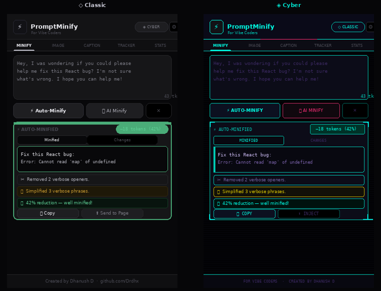
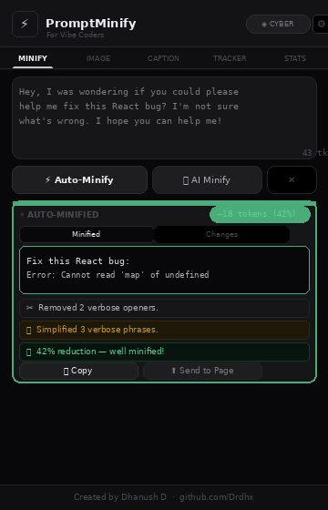
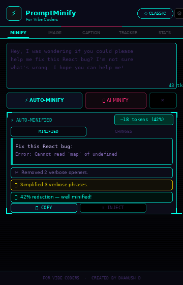
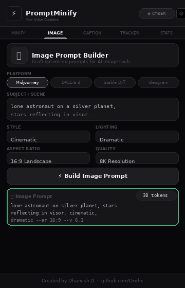
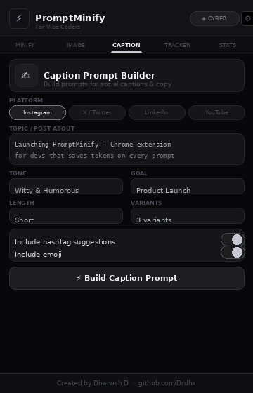
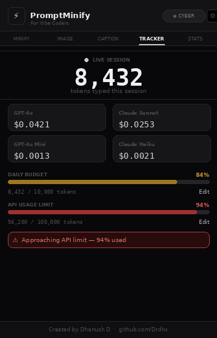

# ⚡ PromptMinify — For Vibe Coders

> **Minify AI prompts for vibe coders — spend less tokens, get sharper results.**

[](https://github.com/Drdhx/promptminify/releases)
[](LICENSE)
[](manifest.json)
[](https://chrome.google.com/webstore)

---

## 🖼 Screenshots

### Theme Comparison — Classic vs Cyber



### ⚡ Minify Tab — Classic Theme



### ◈ Minify Tab — Cyber Theme



### 🖼 Image Prompt Builder



### ✍ Caption Prompt Builder



### 📊 Live Token Tracker



---

## 🧩 What is PromptMinify?

PromptMinify is a Chrome extension built **for vibe coders** — people who write long, conversational AI prompts while coding. It strips the bloat, rewrites your prompts to be leaner, and saves you real money on API bills.

---

## ✨ Features

- **⚡ Auto-Minify** — 8-stage local rewriter: removes fillers, disclaimers, redundancy, verbose phrases and duplicate sentences
- **🤖 AI Minify** — Uses any LLM API key to intelligently compress prompts by 40–60%
- **🎨 Dual Themes** — Premium Black/Silver (Classic) and Cyberpunk Neon (Cyber)
- **🖼 Image Prompt Builder** — Craft optimized prompts for Midjourney, DALL·E 3, Stable Diffusion, Ideogram
- **✍ Caption Prompt Builder** — Build social caption prompts for Instagram, X/Twitter, LinkedIn, YouTube
- **📊 Live Token Tracker** — Real-time token counter injected on Claude, ChatGPT, Gemini, Perplexity
- **💰 Cost Estimator** — Live cost breakdown for GPT-4o, Claude Sonnet, GPT-4o Mini, Claude Haiku
- **🎯 Custom API Usage Limit** — Set your own token cap with red warning at 90% and 100%
- **📅 Daily Budget Meter** — Track daily token usage with visual progress bar
- **🟢 Green / 🔴 Red Highlights** — Green border when optimized, red when no changes made
- **📋 One-click Copy & Inject** — Push optimized prompt directly into the active AI chat textarea
- **⭐ Custom Templates** — Save your own vibe coding prompt templates

---

## 🚀 Install (Developer Mode)

1. **Download** or clone this repo
2. Open **`chrome://extensions/`**
3. Enable **Developer mode** (toggle top-right)
4. Click **Load unpacked**
5. Select the `promptminify/` folder
6. **Pin** the extension to your toolbar

```bash
git clone https://github.com/Drdhx/promptminify.git
```

---

## 🛠 Project Structure

```
promptminify/
├── manifest.json       # Chrome Extension Manifest v3
├── popup.html          # Main popup UI (5 tabs)
├── popup.css           # Premium dual-theme design system
├── popup.js            # Core logic — rewriter, tracker, builders
├── content.js          # Injected floating badge on AI pages
├── content.css         # Floating badge styles
├── background.js       # Service worker
├── options.html        # Settings page
├── options.js          # Settings logic
├── screenshots/        # README preview images
└── icons/
    ├── icon16.png
    ├── icon32.png
    ├── icon48.png
    └── icon128.png
```

---

## 🌐 Supported Platforms

| AI Chat | Image Gen |
|---|---|
| claude.ai | midjourney.com |
| chatgpt.com | ideogram.ai |
| gemini.google.com | leonardo.ai |
| perplexity.ai | firefly.adobe.com |
| copilot.microsoft.com | |
| cursor.sh | |

---

## 🔑 AI Minify Setup

1. Click the extension → **⚙ Settings**
2. Paste any LLM API key (Anthropic, OpenAI, etc.)
3. Your key is stored **locally only** — never sent anywhere else
4. Use the **🤖 AI Minify** button to compress via AI

---

## 💡 How Auto-Minify Works

8-stage local rewriting engine:

| Stage | What it removes |
|---|---|
| 1 | Greeting/preamble openers |
| 2 | Verbose openers → direct imperatives |
| 3 | Apology/disclaimer sentences |
| 4 | Obvious code comments |
| 5 | Verbose phrases ("in order to" → "to") |
| 6 | Duplicate sentences |
| 7 | Excessive blank lines & trailing whitespace |
| 8 | Filler words (basically, actually, very, really) |

---

## 🎨 Themes

**Classic** — Premium black & silver. Refined typography, chrome gradients, subtle borders.

**Cyber** — Full cyberpunk. Orbitron font, animated neon glow, cyan/pink accents, scanline overlay.

Switch between them with the toggle button in the header — persists across sessions.

---

## 🗺 Roadmap

- [ ] Firefox support
- [ ] Context menu right-click optimize
- [ ] Prompt history with search
- [ ] Export stats as CSV
- [ ] Team shared templates

---

## 📄 License

MIT © 2025 [Dhanush D](https://github.com/Drdhx)

---

## 🤝 Contributing

Pull requests welcome! Open an issue for major changes first.

```bash
git checkout -b feature/your-feature
git commit -m "feat: add your feature"
git push origin feature/your-feature
```

---

<p align="center">
  <strong>⚡ PromptMinify — For Vibe Coders</strong><br/>
  Created by <a href="https://github.com/Drdhx">Dhanush D</a>
</p>
